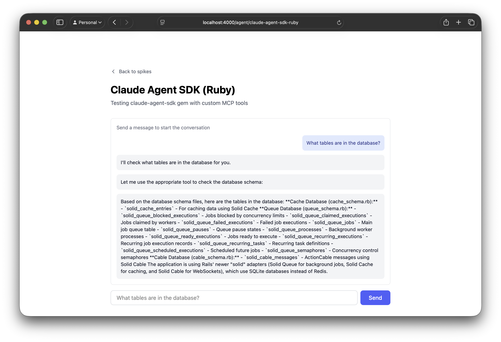

# Claude Agent Rails Spike

This is an exploration into 3 different approaches to integrating Claude Code /
Claude Agent with a Rails application:

1) Via
[claude-agent-sdk-ruby](https://github.com/ya-luotao/claude-agent-sdk-ruby), an
unofficial Ruby port of the Claude Agent Python SDK which spawns Node
subprocesses

2) Via
[claude-agent-sdk-typescript](https://github.com/anthropics/claude-agent-sdk-typescript),
the official TypeScript SDK, and a persistent sidecar Node process

3) Via [claude-code-acp](https://github.com/zed-industries/claude-code-acp), an
unofficial [Agent Client Protocol](https://agentclientprotocol.com) wrapper and
separate subprocesses


The spikes are documented in `./docs/`.

Implementations:

- https://github.com/tvararu/claude-agent-rails-spike/pull/1
- https://github.com/tvararu/claude-agent-rails-spike/pull/2
- https://github.com/tvararu/claude-agent-rails-spike/pull/3

## Architecture comparison

| Aspect | Ruby SDK | TypeScript SDK | ACP |
|--------|----------|----------------|-----|
| **Communication** | Gem manages subprocess | HTTP POST/SSE | Subprocess + stream JSON |
| **Services** | Single (Rails) | Multi (Rails + Node) | Single (Rails) |
| **Tool Pattern** | In-process MCP | HTTP callbacks | MCP via stdio |
| **Language** | Ruby + Node (gem-managed) | Ruby + TypeScript | Ruby + Node (CLI) |
| **Standardization** | Unofficial gem | Official SDK | MCP protocol |

## Motivation

Claude Code is a very powerful framework for automation, not just for writing
code. There are many usecases where giving an LLM tool-use, filesystem access,
and permission to run and execute scripts vastly enhances its capabilities.

While the objective of this repo is to display a GUI that lets you chat to a
Claude Code-style interface directly, that's not the only way. You can spawn an
agent entirely in the background, using jobs/workers, and give it tools to read
and write to the database.

This spike is about finding the cleanest, most maintainable way to do so.

## Setup

This repo was generated with:

```sh
rails new claude-agent-rails-spike \
          -c tailwind \
          --skip-action-mailer \
          --skip-action-mailbox \
          --skip-action-text \
          --skip-jbuilder \
          --skip-kamal \
          --skip-docker \
          --skip-ci \
          --skip-test
```

To run:

```sh
cp mise.local.toml.example mise.local.toml
mise install
bin/setup
```

## Results

### Spike 1 (Claude Agent SDK Ruby)

**Architecture:**
```
┌─────────┐      ┌──────────────┐      ┌─────────────────────┐      ┌────────────┐
│ Browser │─────▶│ Rails Server │─────▶│ claude-agent-sdk-   │─────▶│ Claude API │
│         │◀─────│ (ActionCable)│◀─────│ ruby Gem            │◀─────│            │
└─────────┘      └──────────────┘      │ (manages Node       │      └────────────┘
                         │             │  subprocess)        │
                         │             └─────────────────────┘
                         ▼                        │
                  ┌──────────────┐                │
                  │ ActiveRecord │◀───────────────┘
                  │  (MCP tools) │   In-process calls
                  └──────────────┘
```

**Key Points:**
- Single Rails service, gem manages Node subprocess internally
- MCP tools execute in-process with direct ActiveRecord access
- Simplest integration, minimal configuration



### Spike 2 (Claude Agent SDK TypeScript)

**Architecture:**
```
┌─────────┐      ┌──────────────┐      ┌─────────────────┐      ┌────────────┐
│ Browser │─────▶│ Rails Server │─────▶│ Node Service    │─────▶│ Claude API │
│         │◀─────│ (ActionCable)│◀─────│ (TypeScript SDK)│◀─────│            │
└─────────┘      └──────────────┘      └─────────────────┘      └────────────┘
                         ▲                        │
                         │                        │ Tool execution
                         │                        │ (HTTP callbacks)
                         │                        ▼
                         │              ┌─────────────────┐
                         └──────────────│ Rails API       │
                            HTTP POST   │  /api/schema    │
                                        └─────────────────┘
                                                 │
                                                 ▼
                                          ┌──────────────┐
                                          │ ActiveRecord │
                                          └──────────────┘
```

**Key Points:**
- Two separate services: Rails + Node (runs via Procfile)
- Tools execute via HTTP callbacks to Rails API
- Independent scaling, microservices architecture


### Spike 3 (Claude ACP)

**Architecture:**
```
┌─────────┐      ┌──────────────┐      ┌─────────────────┐      ┌────────────┐
│ Browser │─────▶│ Rails Server │─────▶│ Claude CLI      │─────▶│ Claude API │
│         │◀─────│ (ActionCable)│◀─────│  (subprocess)   │◀─────│            │
└─────────┘      └──────────────┘      │ --output-format │      └────────────┘
                         │             │  stream-json    │
                         │             └─────────────────┘
                         │                        │
                         │                        │ MCP protocol
                         │                        │ (JSON-RPC stdio)
                         │                        ▼
                         │              ┌─────────────────┐
                         │              │ Ruby MCP Server │
                         │              │  mcp_server.rb  │
                         │              └─────────────────┘
                         │                        │
                         │                        ▼
                         │              ┌─────────────────┐
                         └─────────────▶│ ActiveRecord    │
                            Direct      │  (check_schema) │
                            access      └─────────────────┘
```

**Key Points:**
- Single Rails service, spawns Claude CLI subprocess per connection
- Ruby MCP server communicates via stdio (JSON-RPC)
- Pure Ruby tool development with direct ActiveRecord access
- Clean separation via MCP protocol


## License

[MIT](LICENSE).
